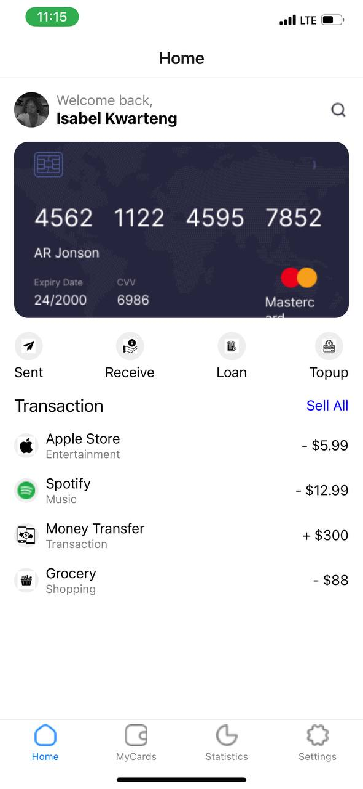
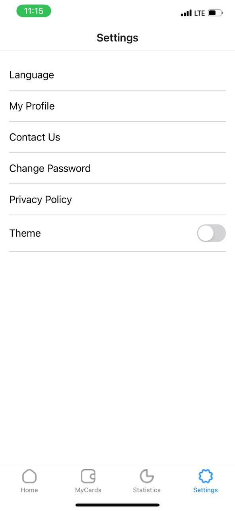
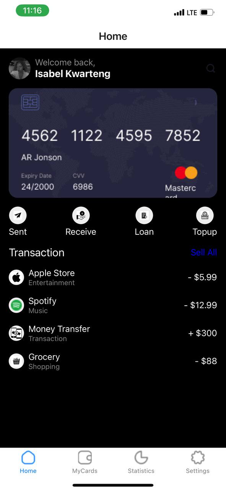
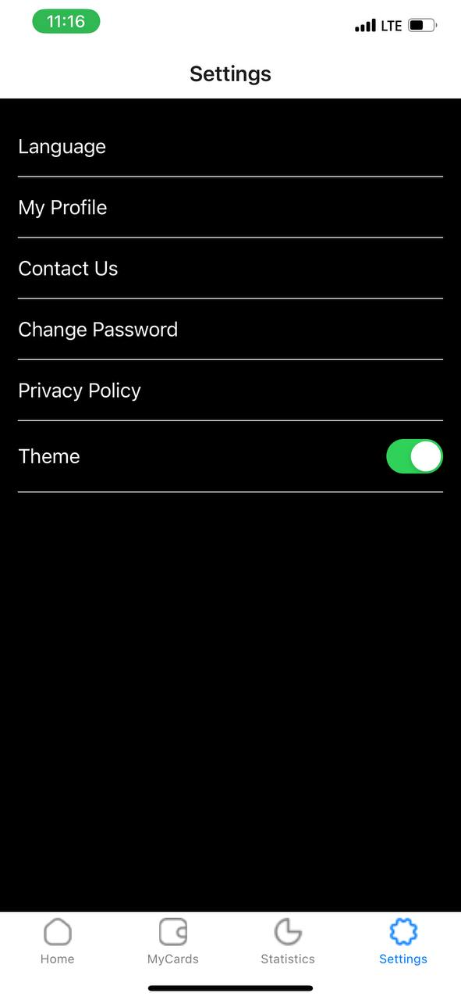

## DCIT 202 ASSIGNMENT 5

## STUDENT ID: 11290273

## Brief Description of the Creation of the App
I started by creating a new React Native project and cloning the GitHub source in order to develop the application. I focused on precisely duplicating the visual components and layout in order to replicate the design as it appeared in the given UI mockup. I created the Home and Settings screens with bottom tab navigation using React Navigation. I used React's Context API to manage state for the theme switching feature, which allows me to transition between light and dark modes in response to user input.
I employed custom components to guarantee consistency and reusability throughout the development process. To closely match the UI design, I refined the program using a combination of custom styles and StyleSheet. Resources, including icons, were incorporated from the supplied Google Drive folder. Ultimately, prior to submitting the repository, I made sure to extensively test the application and make sure all functionality functioned as intended.

## Screenshots

